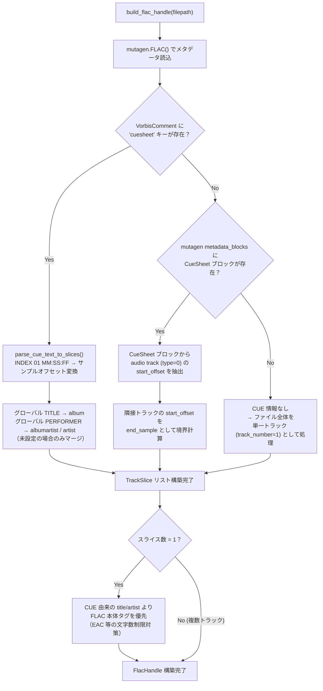
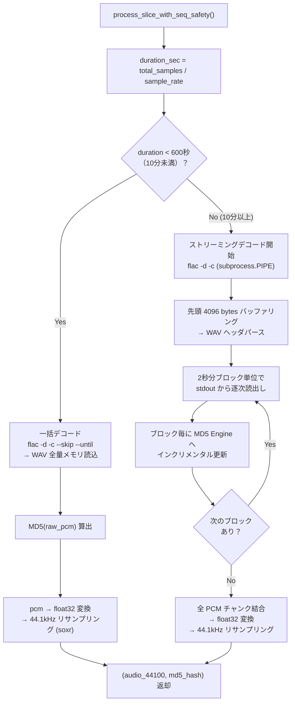

# CUE シートパース＆フォールバックフロー

本ドキュメントは、`flac_decode.py` における FLAC ファイルの CUE シート検出・パース・トラック分割の判定ロジックと、長尺ファイルに対するストリーミングデコードの挙動を解説します。

---

## 1. CUE 検出・パース判定フロー

FLAC ファイルからトラック境界を抽出する際、以下の優先順序で CUE 情報を探索し、最初にヒットしたソースからスライスを構築します。すべて見つからなかった場合は、ファイル全体を単一トラックとして安全にフォールバックします。



### 判定優先順位まとめ

| 優先度 | CUE ソース | 取得先 | 備考 |
|:---:|:---|:---|:---|
| **1** | VorbisComment `cuesheet` | FLAC タグ（テキスト形式） | EAC / foobar2000 等がエンコード時に埋め込む形式 |
| **2** | Mutagen CueSheet metadata block | FLAC メタデータブロック（バイナリ形式） | FLAC 仕様上の正式な CUESHEET ブロック |
| **3** | *(フォールバック)* | — | CUE 情報なし → ファイル全体を1トラックとして処理 |

---

## 2. INDEX 01 → サンプルオフセット変換

CUE テキストの `INDEX 01 MM:SS:FF` を内部サンプル位置へ変換するロジック：

```
total_seconds = MM × 60 + SS + FF / 75.0
sample_offset = int(total_seconds × sample_rate)
```

- `FF` は CD フレーム単位（1秒 = 75フレーム）
- 各トラックの `end_sample` は次トラックの `start_sample`、最終トラックは `total_samples`

---

## 3. 長尺ファイルのストリーミングデコード

`process_slice_with_seq_safety()` は、トラック長に応じてデコード戦略を動的に切り替えます。



### 設計意図

| 項目 | 10分未満 | 10分以上（DJミックス等） |
|:---|:---|:---|
| **デコード方式** | 一括メモリ読込 | ストリーミング (2秒ブロック) |
| **MD5 算出** | 一括 `hashlib.md5(raw_pcm)` | インクリメンタル `md5_engine.update(block)` |
| **メリット** | シンプル＆高速 | RAM ピーク使用量を抑制 |

### WAV ヘッダパース (`parse_wav_header`)

- RIFF/WAVE チャンク走査で `fmt ` と `data` チャンクを探索
- `WAVE_FORMAT_EXTENSIBLE` (`0xFFFE`) の SubFormat GUID からも実フォーマットを正確に取得
- 16bit / 24bit / 32bit PCM Integer および 32bit / 64bit IEEE Float に対応
