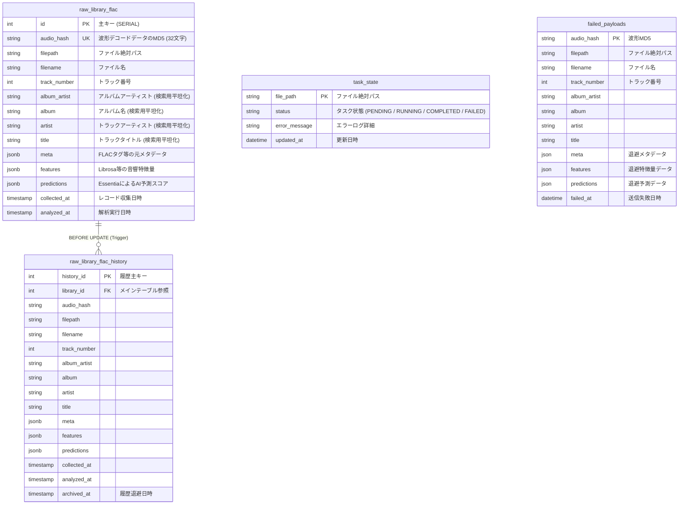

# FLAC Analyzer DB Information

現在のプロジェクトにおけるデータベース（PostgreSQL）およびオーケストレーター / DLQ 用 SQLite の ER 図、データ構造仕様、テーブル定義詳細ですわ。
以下の Mermaid コードは、draw.io（[Insert] -> [Advanced] -> [Mermaid]）等に直接貼り付けてインポートすることができます。

## ER図 (Mermaid形式)



## JSONB データ構造仕様

`raw_library_flac` の `JSONB` カラムに格納される具体的なデータフォーマットです。

### `meta` カラム (元タグ・CUEシート情報)
※ `artist` や `genre` 等のマルチバリュータグ（複数値）は、文字列結合で潰さず JSON 配列 (`["...", "..."]`) として完全保持されます。

```json
{
  "album": "Album Title",
  "artist": ["Artist A", "Artist B"],
  "title": "Track Title",
  "date": "2024-01-01",
  "tracknumber": "01",
  "genre": ["Electronic", "Synthwave"],
  "albumartist": "Various Artists",
  "cuesheet": "FILE \"sample.flac\" WAVE ..."
}
```

### `features` カラム (音響特徴量)
```json
{
  "mix": {
    "scalars": {
      "bpm": 128.0,
      "rms_mean": 0.153,
      "rms_std": 0.045,
      "energy": 45.2,
      "spectral_centroid_mean": 2500.5,
      "zcr_mean": 0.052,
      "hnr_nap": 0.825
    },
    "sequences": {
      "rms": [0.08, 0.12, 0.15, "...(固定32要素)"],
      "spectral_centroid": [1200.0, 1500.0, "..."],
      "mfcc": [
        [-120.0, -115.0, "..."],
        [40.0, 42.0, "..."]
      ]
    }
  },
  "bass": {
    "scalars": {
      "rms_mean": 0.081,
      "spectral_centroid_mean": 450.2
    }
  }
}
```

### `predictions` カラム (AIモデル予測スコア)
```json
{
  "danceability": 852,
  "tonal_atonal": 910,
  "mood_happy": 720,
  "mood_sad": 105,
  "genre_rosamerica": {
    "house": 800,
    "techno": 150,
    "classical": 50
  }
}
```

## テーブル定義詳細

### raw_library_flac
メインとなる楽曲情報・解析結果を格納するテーブルです。常に最新の情報を保持します。

| カラム名 | 型 | 制約等 | 説明 |
| :--- | :--- | :--- | :--- |
| id | SERIAL | PRIMARY KEY | 主キー |
| audio_hash | VARCHAR(32) | NOT NULL, UNIQUE | 各曲のデコード後波形(numpy)のMD5(16進数32文字)。トラックごとの一意性を担保 |
| filepath | TEXT | NOT NULL, INDEX | 最新のファイル絶対パス。ファイル移動の検知に使用 |
| filename | TEXT | NOT NULL | 最新のファイル名 |
| track_number | INT | | CUEシート分割時のトラック番号（なければNULL） |
| album_artist | VARCHAR | INDEX | アルバムアーティスト (検索性能向上用平坦化カラム) |
| album | VARCHAR | INDEX | アルバム名 (検索性能向上用平坦化カラム) |
| artist | VARCHAR | INDEX | 曲のアーティスト (検索性能向上用平坦化カラム) |
| title | VARCHAR | INDEX | 曲のタイトル (検索性能向上用平坦化カラム) |
| meta | JSONB | NOT NULL, DEFAULT '{}' | アーティスト、アルバム、タイトル等の最新詳細メタデータ |
| features | JSONB | NOT NULL, DEFAULT '{}', GIN | 各ステムのLibrosa音響特徴量 |
| predictions | JSONB | NOT NULL, DEFAULT '{}', GIN | Essentiaによる分類結果（mix等） |
| collected_at | TIMESTAMP (TZ) | NOT NULL, DEFAULT CURRENT_TIMESTAMP | 収集・更新検知日時 |
| analyzed_at | TIMESTAMP (TZ) | | 解析実行日時（未解析やスキップ時はNULL） |

### raw_library_flac_history
raw_library_flac テーブルの更新時に、古いレコードの情報を退避するための履歴保存用テーブルです。

| カラム名 | 型 | 制約等 | 説明 |
| :--- | :--- | :--- | :--- |
| history_id | SERIAL | PRIMARY KEY | 履歴の主キー |
| library_id | INT | NOT NULL | raw_library_flac.id に対応（外部キー相当） |
| audio_hash | VARCHAR(32) | NOT NULL | 当時のaudio_hash |
| filepath | TEXT | NOT NULL | 当時のファイルパス |
| filename | TEXT | NOT NULL | 当時のファイル名 |
| track_number | INT | | 当時のトラック番号 |
| album_artist | VARCHAR | | 当時のアルバムアーティスト |
| album | VARCHAR | | 当時のアルバム名 |
| artist | VARCHAR | | 当時の曲アーティスト |
| title | VARCHAR | | 当時の曲タイトル |
| meta | JSONB | NOT NULL | 当時のメタデータ |
| features | JSONB | NOT NULL | 当時の音響特徴量 |
| predictions | JSONB | NOT NULL | 当時の分類結果 |
| collected_at | TIMESTAMP (TZ) | NOT NULL | 当時の収集日時 |
| analyzed_at | TIMESTAMP (TZ) | | 当時の解析実行日時 |
| archived_at | TIMESTAMP (TZ) | NOT NULL, DEFAULT CURRENT_TIMESTAMP | 履歴として退避された日時 |

### データベーストリガー
- `trg_archive_library_flac`
  - 対象: `raw_library_flac` の BEFORE UPDATE
  - 条件: `meta` または `features` に変更があった場合
  - 動作: 更新前の古いレコード（OLD）を `raw_library_flac_history` にINSERTして履歴を残します。