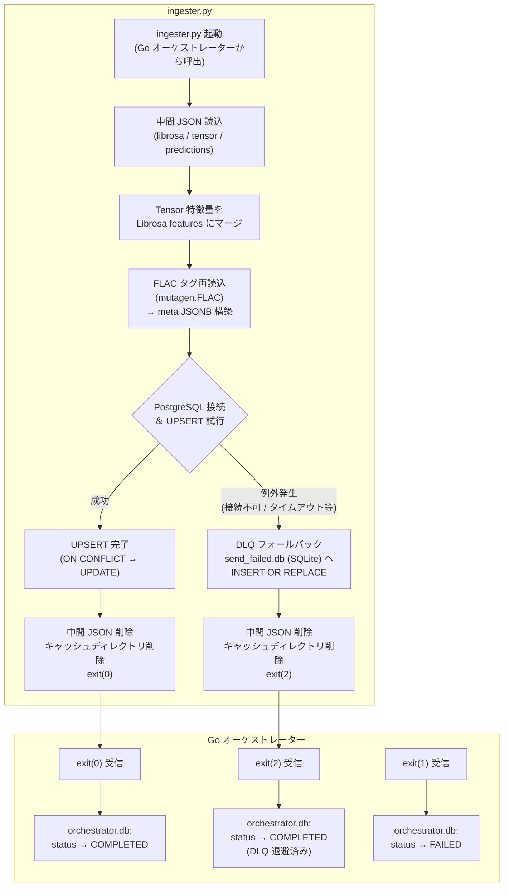
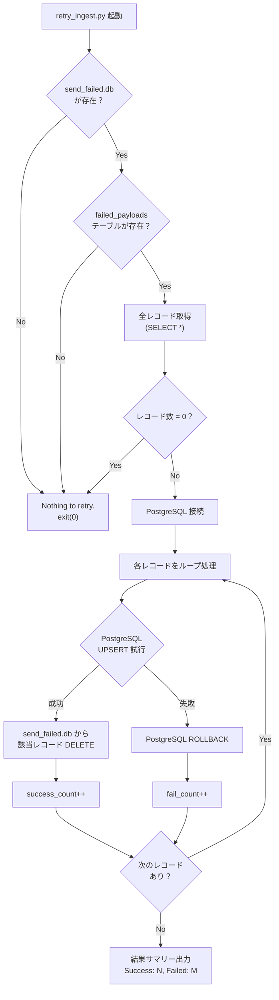
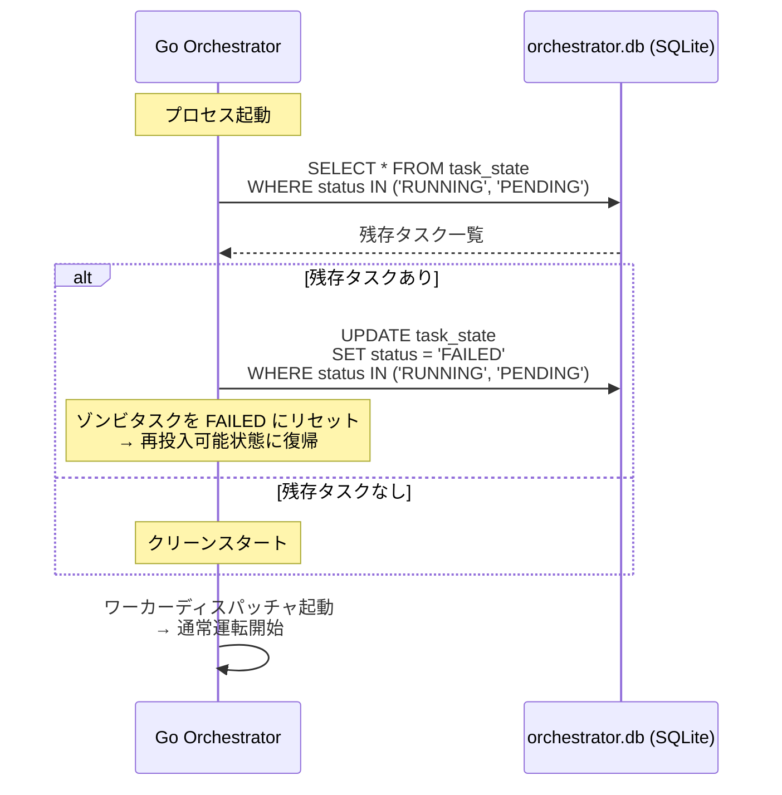
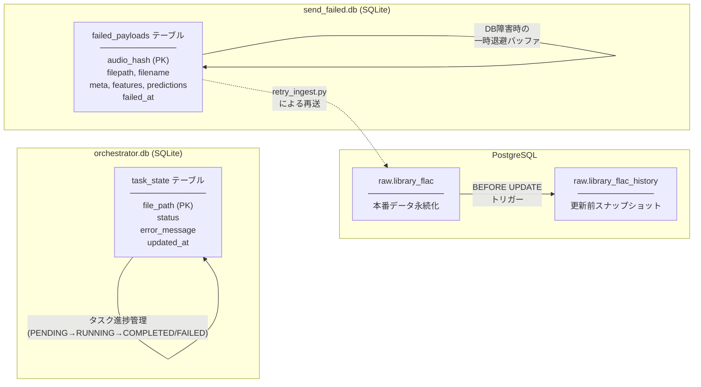

# DLQ (Dead Letter Queue) パターン＆エラーリカバリフロー

本ドキュメントは、`ingester.py` および `retry_ingest.py` による PostgreSQL 永続化・DLQ フォールバック・再送処理の全体フロー、ならびにオーケストレーター起動時のゾンビタスク自動リセットの仕組みを解説します。

---

## 1. 全体フロー図

### 終了コードの意味

| Exit Code | 意味 | オーケストレーター側の処理 |
|:---:|:---|:---|
| `0` | PostgreSQL UPSERT 成功 | タスクを `COMPLETED` に更新 |
| `2` | DB 障害 → DLQ 退避成功 | タスクを `COMPLETED` に更新（データは DLQ に安全保管） |
| `1` | 致命的エラー（DLQ 書込すら失敗） | タスクを `FAILED` に更新 |

---

## 2. DLQ 再送フロー (`retry_ingest.py`)

### 再送の設計ポイント

- **レコード単位のトランザクション**: 1レコードの UPSERT 失敗が他のレコードに影響しないよう、各レコードを独立してコミット/ロールバック
- **冪等性**: `ON CONFLICT (audio_hash) DO UPDATE` により、何度再送しても安全
- **成功したレコードは即時 DLQ から DELETE**: 再送ループ中に `send_failed.db` から削除されるため、中断しても再実行時に二重送信されない

---

## 3. ゾンビタスク自動リセット

オーケストレーター起動時に、前回クラッシュ等でステータスが中途半端な状態で残ったタスクを自動検知・リセットします。

---

## 4. データストア役割分担

| データストア | 目的 | ライフサイクル |
|:---|:---|:---|
| `orchestrator.db` | タスク状態管理（重複防止・進捗追跡） | オーケストレーター常時使用 |
| `send_failed.db` | DB 障害時の解析結果一時退避 | 正常時は空、障害時に蓄積→再送で消化 |
| PostgreSQL | 解析結果の永続化（本番データ） | 最終到達地点 |
