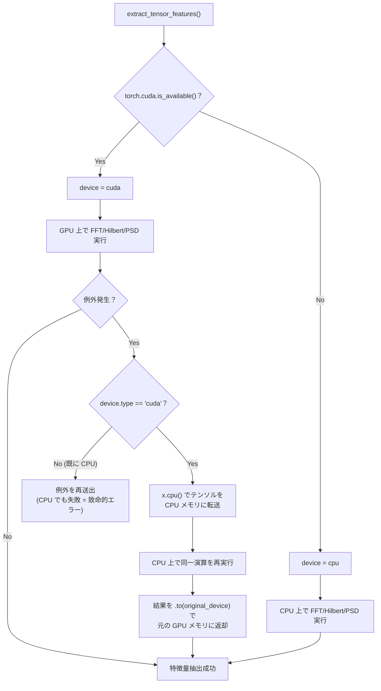
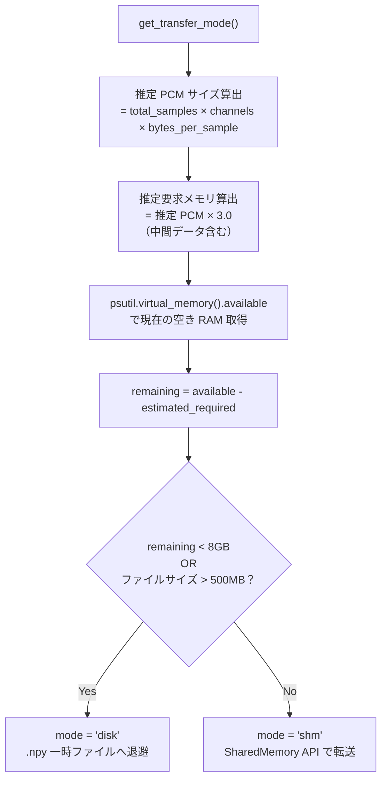
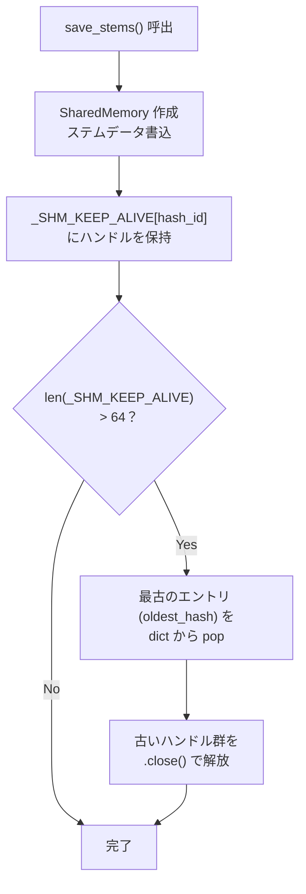

# GPU/CUDA フォールバック＆ RAM 防御フロー

本ドキュメントは、`worker_tensor.py` における CUDA → CPU 自動フォールバック機構と、`load_wave.py` におけるシステム RAM 残量に基づく SHM/ディスク動的切替＆ FIFO キャッシュ管理を解説します。

---

## 1. CUDA → CPU 自動フォールバック (`worker_tensor.py`)

PyTorch テンソル演算（FFT, Hilbert変換, バンドパスフィルタリング等）は、CUDA GPU が利用可能な場合に GPU で実行されます。しかし、以下の障害が発生した場合に **自動で CPU にフォールバック** して処理を続行します。

### フォールバック対象の障害

| 障害 | 発生原因 | 検知方法 |
|:---|:---|:---|
| CUDA OOM | GPU VRAM 不足（長尺ファイル等） | `RuntimeError` キャッチ |
| cuFFT エラー | FFT サイズ制限超過・ドライバ不整合 | `RuntimeError` キャッチ |

### フォールバックフロー



### 実装パターン

`hilbert_envelope_phase()` と `fft_bandpass_envelope()` の両関数に同一のフォールバックパターンが適用されています：

```python
try:
    # GPU 上で FFT 実行
    Xf = torch.fft.fft(x)
    ...
except Exception as e:
    if x.device.type == "cuda":
        # CPU にフォールバック
        x_cpu = x.cpu()
        Xf = torch.fft.fft(x_cpu)
        ...
        return result.to(x.device)  # 結果を GPU に戻す
    raise e  # CPU でも失敗した場合は致命的
```

### 設計意図

- **透過性**: フォールバックは呼出元に対して透過的。`extract_tensor_features()` は GPU/CPU の違いを意識する必要がない
- **結果の一貫性**: CPU フォールバック後、結果テンソルは元のデバイスに `.to(x.device)` で戻されるため、後続処理への影響がゼロ
- **安全性**: CPU でも同一演算が失敗した場合のみ例外を再送出（真の致命的エラー）

---

## 2. RAM 残量ベースの SHM / ディスク動的切替 (`load_wave.py`)

`load_wave.py` は、デコード済み波形データ（ステム）を後続ワーカーに渡す際の転送方式を、**システムの空き RAM 量に基づいてリアルタイムに判定** します。

### 判定フロー



### 転送モード比較

| 項目 | `shm` モード | `disk` モード |
|:---|:---|:---|
| **転送経路** | `multiprocessing.SharedMemory` | `.npy` ファイル (tempdir) |
| **速度** | ゼロコピー（高速） | ディスク I/O（低速） |
| **RAM 消費** | PCM + SHM 領域 | PCM のみ（ディスクに退避） |
| **発動条件** | 空き RAM ≥ 8GB **かつ** ファイル ≤ 500MB | 空き RAM < 8GB **または** ファイル > 500MB |

---

## 3. FIFO キャッシュ管理（メモリリーク防止）

`save_stems()` は SHM モードでステムを書き込む際、`_SHM_KEEP_ALIVE` 辞書でハンドルを保持します。無制限に蓄積するとメモリリークとなるため、**FIFO 方式で最大 64 トラック分** に制限しています。



### 設計意図

| パラメータ | 値 | 根拠 |
|:---|:---|:---|
| `MAX_CACHE_TRACKS` | 64 | Go オーケストレーターのキューサイズ最大 32 の 2 倍。競合マージンを確保 |
| FIFO 戦略 | 最古エントリ優先解放 | 新しいトラックほど後続ワーカーからの参照可能性が高い |

---

## 4. Python ワーカー内音響特徴量抽出の float32 保持 ＆ キャッシュ完全解放

`analyzer.py` の Librosa 音響特徴量（`spectral_centroid`, `spectral_rolloff`, `spectral_bandwidth` 等）抽出において、以下のメモリ防護が適用されています：

- **`float32` 直計算による暗黙 64-bit float キャスト排除**:
  - `AudioContext.centroid`: Librosa の `spectral_centroid` 呼出を廃止し、`spectro` (float32) からの直接演算により float32 保持のまま超高速に計算。
  - `_calc_rolloff_features`: Librosa 内部で発生していた 291 MiB の巨大 float64 配列（`np.where`）割当を消去し、`float32` の `cumsum` による軽量実装へ置換。
- **一元プロパティキャッシュ化**:
  - `_calc_spectral_centroid_mean` および `_calc_spectral_centroid_sd` において `ctx.centroid` を一元参照し、重いアロケーションの二重発生を防止。
- **`AudioContext.clear()` による完全解放**:
  - 各ステム処理後、`self._centroid` を含むすべてのプロパティキャッシュ参照を即座に `None` 化し、GC（ガベージコレクション）によるメモリ即時回収を保証。

---

## 5. 既存ドキュメントとの関連

本ドキュメントで解説する RAM 防御は **ワーカープロセスレベル** の自律的保護機構です。これとは別に、**Go オーケストレーターレベル** の RAM 制御として以下が存在します：

| レイヤー | 機構 | 詳細ドキュメント |
|:---|:---|:---|
| **Go オーケストレーター** | `MaxRamRatio` バックプレッシャー ＆ `estimated_worker_ram_gb = 3.5` 動的クランプ<br/>（タスク投入前に空き RAM を監視し、上限超過時にスリープ） | [cpu_parallelism_and_ram_guard.md](cpu_parallelism_and_ram_guard.md) |
| **Python ワーカー** | `get_transfer_mode()` による SHM/ディスク動的切替<br/>CUDA OOM → CPU フォールバック<br/>Librosa `float32` 直計算 ＆ `AudioContext.clear()` 完全解放 | 本ドキュメント |

両レイヤーが協調することで、**システム全体の OOM および WinError 1455 コミット制限超過を多段防御** しています。

