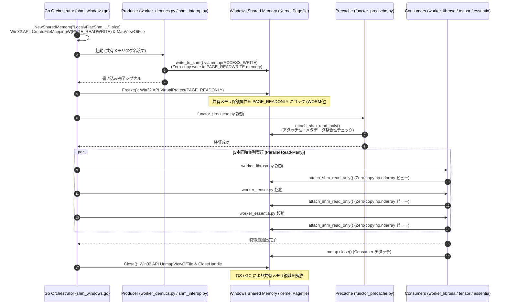

# Windows 共有メモリ (SHM) 管理と WORM アーキテクチャ

本システムでは、Windows 環境において大量の音源ファイル（数十GB〜数TB）を一括処理する際のメモリ不足（OOM）や I/O ボトルネックを根絶するため、**Windows 共有メモリ (Shared Memory) による WORM (Write-Once Read-Many) アーキテクチャ** を採用しています。

## 1. WORM (Write-Once Read-Many) アーキテクチャ

1. **書き込みフェーズ (Write Phase)**:
   - `worker_demucs.py` が FLAC ファイルをスライスデコードし、Demucs による音源分離 (stems: `mix`, `drums`, `bass`, `other`, `vocals`) を実行します。
   - 分離された float32 多次元配列テンソルは、`shm_interop.py` (`write_to_shm` / `mmap.ACCESS_WRITE`) を介して Win32 API (`CreateFileMappingW`, `MapViewOfFile`) により `PAGE_READWRITE` モードでメモリ上に作成された命名共有メモリ領域に直接書き込まれます。
2. **フリーズフェーズ (Freeze Phase)**:
   - Go オーケストレーター (`shm_windows.go`) が Python プロセスからの書き込み完了を検知すると、`VirtualProtect` を呼び出して共有メモリのメモリ保護属性を `PAGE_READWRITE` から **`PAGE_READONLY`** へ変更（フリーズ）します。
3. **並行読み取りフェーズ (Read-Many Phase)**:
   - 後続の特徴量抽出ワーカー (`functor_precache.py`, `worker_librosa.py`, `worker_tensor.py`, `worker_essentia.py`) は、`PAGE_READONLY` で保護された共有メモリ領域に `shm_interop.attach_shm_read_only()` 経由でアタッチします。
   - `functor_precache.py` は、ディスクへの中間 `.npy` ファイル保存を完全に排除し、共有メモリのアタッチ性検証とメタデータ整合性の高速チェックのみを行います。
   - 各抽出ワーカーは、他のワーカーや自身の誤動作によって共有メモリ上の波形データが改変されるリスクから物理的に保護された状態で並行解析を実行します。

## 2. Producer-Consumer ゼロコピー IPC シーケンス (Mermaid)

## 3. Win32 API 呼出一覧と役割

Windows C API (`kernel32.dll`) を Go言語の `syscall.NewLazyDLL` から直接呼び出して制御しています。

| API 名 | 主なパラメーター / 定数 | 役割と詳細 |
| :--- | :--- | :--- |
| `CreateFileMappingW` | `INVALID_HANDLE_VALUE`, `PAGE_READWRITE`, `size`, `name` | Windows ページングファイルバックの命名共有メモリハンドルの作成 |
| `MapViewOfFile` | `handle`, `FILE_MAP_WRITE \| FILE_MAP_READ`, `0`, `0`, `size` | 共有メモリハンドルをプロセスの仮想アドレス空間へマッピング |
| `VirtualProtect` | `addr`, `size`, `PAGE_READONLY`, `&oldProtect` | 共有メモリ空間のアクセス保護属性を `PAGE_READONLY` に変更（WORMフリーズ処理） |
| `UnmapViewOfFile` | `addr` | プロセスの仮想アドレス空間から共有メモリのマッピングを解除 |
| `CloseHandle` | `handle` | Windows カーネルオブジェクト（共有メモリハンドル）のクローズと解放 |

## 4. ライフサイクル管理とリーク防止メカニズム

- **Win32 API による精密制御**:
  - Go 側では `syscall` または Win32 DLL 経由で `CreateFileMappingW`, `MapViewOfFile`, `VirtualProtect`, `UnmapViewOfFile`, `CloseHandle` を直接呼び出して管理します。
- **同期遅延 (`shm_allocation_delay_sec`)**:
  - 各ワーカーが共有メモリハンドルを閉じる際、OS 側のハンドルフラグクリア待ちによる競合を防ぐため、`shm_allocation_delay_sec` で指定された安全セマフォ遅延が挿入されます。
- **`defer` ステートメントによる確実な解放**:
  - 全ての特徴量抽出タスク完了時、または途中でエラー（例外やワーカー異常終了）が発生した場合でも、Go の `defer` クリーンアップ関数が確実に発動し、`UnmapViewOfFile` および `CloseHandle` を実行して共有メモリ領域を即座に OS へ返還します。
- **タスク単位の精密メモリサイズ計算 (`EstimateShmSizeForTask`)**:
  - CUE シート配下のサブトラック解析時、親 FLAC 全体の巨大なファイルサイズではなく、**切り出し区間のサンプル数 (`(EndSample - StartSample) * channels * 4bytes * 1.5`)** に基づいて必要最小限の共有メモリサイズを動的に計算します。
  - これにより、大容量 CD アルバム等のコンピレーション音源解析時における過剰なコミットチャージ要求（WinError 1455: ページングファイル不足）を完全防止します。
