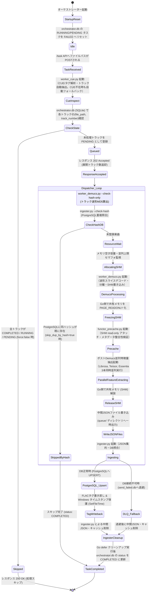

# 状態遷移図 (State Diagram)

本ドキュメントは、Flac_Analyzer システムにおける Go オーケストレーターと Python ワーカープロセス群のタスク処理フローおよび状態遷移を示す図面ですわ。

## 日本語版 (Japanese Version)



## English Version

```mermaid
stateDiagram-v2
    [*] --> StartupReset: Orchestrator Startup
    StartupReset --> Idle: Reset stale RUNNING/PENDING tasks in orchestrator.db to FAILED
    
    Idle --> TaskReceived: File path POSTed to /task API
    TaskReceived --> CueInspect: Execute worker_cue.py<br/>(Parse CUE/tags & extract tracks; graceful single-track fallback if no CUE)
    CueInspect --> CheckState: Check orchestrator.db (SQLite) for each (file_path, track_number)
    
    CheckState --> Skipped: All tracks already COMPLETED / RUNNING / PENDING (when force:false)
    CheckState --> Queued: Unprocessed tracks registered as PENDING
    
    Skipped --> [*]: 200 OK (Skipped)
    Queued --> ResponseAccepted: 202 Accepted (Enqueued tracks count)
    ResponseAccepted --> Dispatcher_Loop
    
    state Dispatcher_Loop {
        CalcHash: worker_demucs.py --check-hash-only<br/>(Calculate track waveform MD5)
        CalcHash --> CheckHashDB: ingester.py --check-hash<br/>(Check duplication in PostgreSQL)
        CheckHashDB --> SkippedByHash: Hash already exists in PostgreSQL (when skip_dup_by_hash=true)
        CheckHashDB --> ResourceWait: New track
        
        ResourceWait --> AllocatingSHM: Monitor RAM & concurrency limit semaphore
        AllocatingSHM --> DemucsProcessing: Execute worker_demucs.py<br/>(Slice decode/Separate/SHM Write)
        DemucsProcessing --> FreezingSHM: Go freezes SHM to PAGE_READONLY
        FreezingSHM --> Precache: Execute functor_precache.py<br/>(Validate SHM read-only attach & metadata)
        Precache --> FeatureExtracting: Execute extraction workers<br/>(Librosa → Tensor → Essentia)
        FeatureExtracting --> ReleaseSHM: Go closes & unmaps SHM handles
        ReleaseSHM --> WriteJSONFiles: Write intermediate JSON files<br/>(Save temporarily to queue/ directory)
        WriteJSONFiles --> Ingesting: Execute ingester.py (Aggregate JSON & DB sync)
    }
    
    SkippedByHash --> TaskCompleted: Mark completed (status: COMPLETED)
    Ingesting --> PostgreSQL_Upsert: DB available (PostgreSQL UPSERT)
    Ingesting --> DLQ_Fallback: DB unreachable (Save to send_failed.db)
    
    PostgreSQL_Upsert --> TagWriteback: Writeback FLAC tags &<br/>Protect Windows timestamp (SetFileTime)
    TagWriteback --> IngesterCleanup: ingester.py purges temp JSON & cache files
    DLQ_Fallback --> IngesterCleanup: Purge temp files after DLQ fallback
    
    IngesterCleanup --> TaskCompleted: Go defer cleanup & update status to COMPLETED in orchestrator.db
    TaskCompleted --> [*]
```
