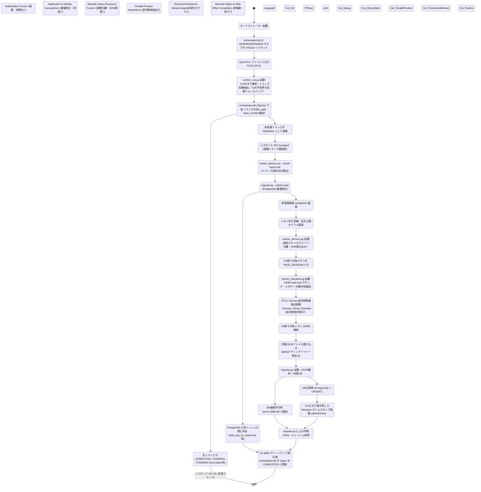
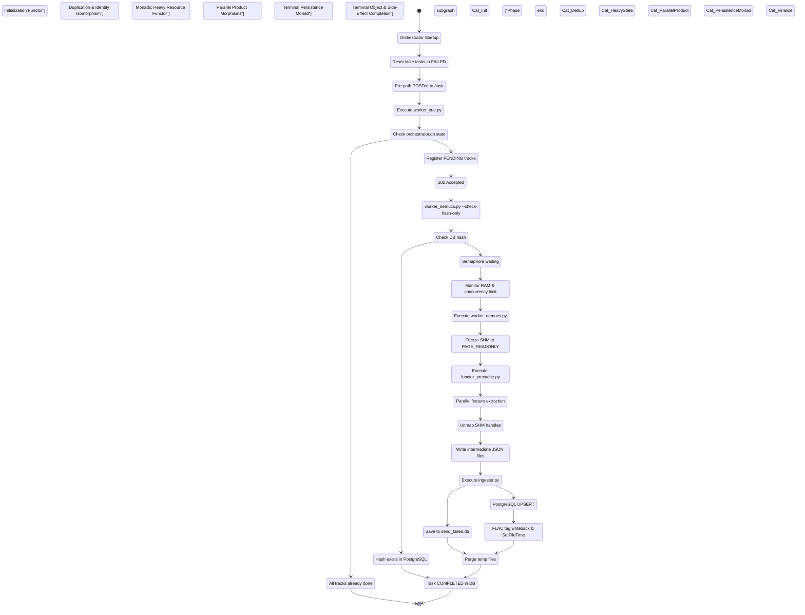

# 状態遷移図 (State Diagram) & 圏論的構造 (Categorical Structure)

本ドキュメントは、Flac_Analyzer システムにおける Go オーケストレーターと Python ワーカープロセス群のタスク処理フローおよび状態遷移を示す図面ですわ。
圏論 (Category Theory) における対象 (Objects)・射 (Morphisms)・関手 (Functors)・モナド (Monads) の考え方に基づき 6 つの Subcategory に分類し、カラーパレットを定義しておりますの。

---

## 圏論的 Subcategory & カラー定義 (Categorical Subcategories)

- **Phase 1: Initialization Functor \(\mathcal{C}_{\text{init}}\)** (灰色 `#334155` / `#64748b`)
  - 起動・設定読込・SQLiteタスク状態リセット・CUE解析
- **Phase 2: Duplication & Identity Isomorphism \(f_{\text{hash}}\)** (暗い青 `#1e3a8a` / `#2563eb`)
  - Waveform MD5算出・PostgreSQL重複照合・Skipped同型判定
- **Phase 3: Monadic Heavy Resource Functor \(\mathcal{T}_{\text{demucs}}\)** (深みのあるグリーン `#065f46` / `#059669`)
  - RAM/SHMセマフォ確保・Demucs音源分離・PAGE_READONLY凍結
- **Phase 4: Parallel Product Morphisms \(F_1 \times F_2 \times F_3\)** (明るいゴールド・イエロー `#854d0e` / `#eab308`)
  - Librosa / Tensor / Essentia 並列特徴量抽出・JSON永続化
- **Phase 5: Terminal Persistence Monad \(\eta: F \Rightarrow G\)** (明るいピンク `#9d174d` / `#ec4899`)
  - JSON集約・PostgreSQL UPSERT・DLQ退避 (SendFailed)
- **Phase 6: Terminal Object & Side-Effect Completion \(\mathcal{T}_{\text{final}}\)** (明るい紫 `#5b21b6` / `#a855f7`)
  - FLACタグ書き戻し・Windows SetFileTime保護・キャッシュ消去

---

## 日本語版 (Japanese Version)

---

## English Version

